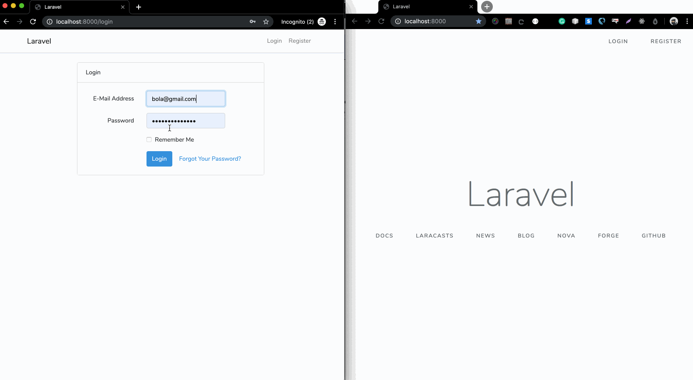

# Add one to one chat to your Laravel app using Stream Chat




## Setting up the app

1. Clone the project to your system:

```sh
git clone https://github.com/dongido001/laravel-one-to-one-stream-chat.git
```

2. Install dependencies

    a. PHP dependencies
    ```sh
    composer install
    ```

    b. JavaScript dependencies

    ```sh
        yarn install
    ```

3. Run build

```sh
yarn run dev
```

4. Set up the database

```sh
cp .env.example .env
```

Then update the `.env` file with your correct database details

5. Run migration

```
php artisan migrate
```

6. Serve the app

```sh
php artisan serve
```

Now visit the development URL to start chatting: [http://localhost:8000](http://localhost:8000)

## Built with

1. Vue.js
2. Laravel
3. Stream Chat